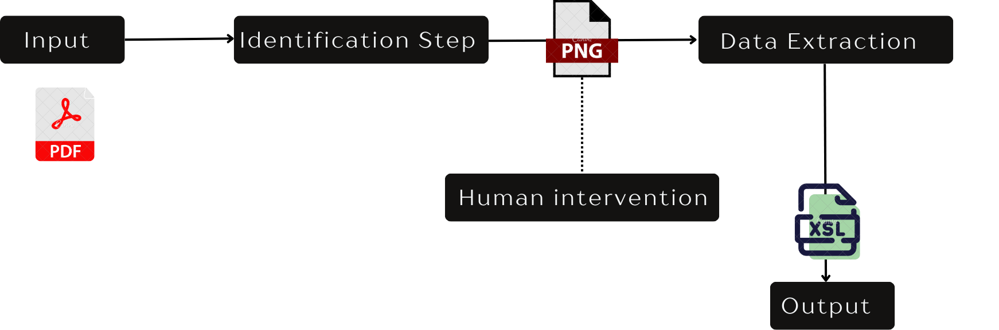
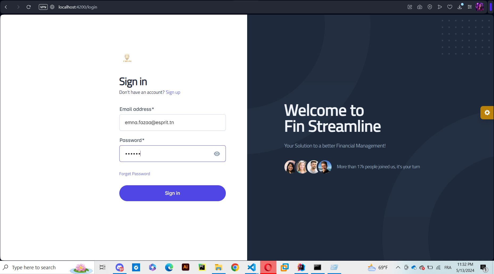
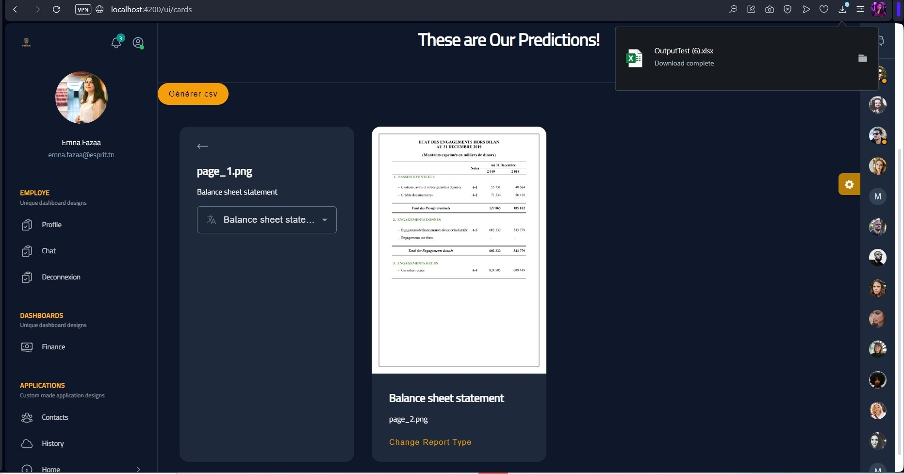
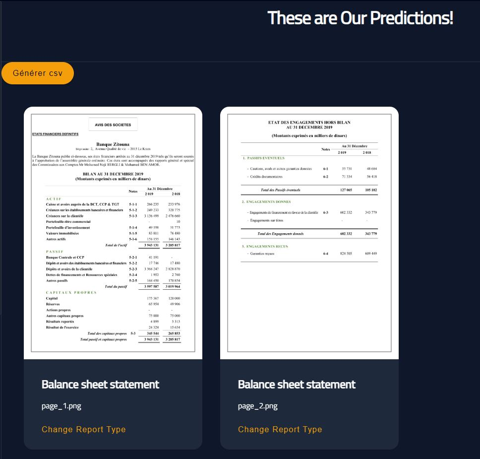

# **Fine-Tuning LayoutLMv3 for Financial Report Classification**

Welcome to the repository for our project focused on fine-tuning the **LayoutLMv3 Large** model on custom financial data. The goal of this project is to enable our fine-tuned model to classify pages of visual financial reports into specific categories: **Balance Sheets, Cash Flow, Income Statement, Notes**, and **Others** (for all other report types included in financial documents that are not of primary interest).

## **Project Overview**

In the financial industry, the ability to automatically classify various sections of a financial report is crucial for efficient data processing and analysis. This project addresses this need by fine-tuning the LayoutLMv3 model on a custom dataset, which was meticulously prepared and is available on [Hugging Face](https://huggingface.co/datasets/EmnaFazaa/financial_data_labled_2).

### **Key Features**

- **Custom Dataset:** The dataset used for fine-tuning was manually curated to ensure accuracy and relevance. It includes a diverse range of financial report pages, classified into key categories crucial for financial analysis.
- **Model Fine-Tuning:** Leveraging the LayoutLMv3 Large model, this project fine-tunes it to recognize and classify the structure of financial documents, focusing on both the visual layout and embedded text.
- **Multi-Lingual Support:** The model supports both English and French, catering to a wide range of financial institutions across different countries.
- **NLP Integration:** The project incorporates Natural Language Processing techniques to handle the complex financial jargon and terminology, supporting multi-lingual text (English and French).
- **OCR Processing:** Using Optical Character Recognition (OCR), specifically PaddleOCR, the project extracts and interprets text from the visual layout of the financial reports, ensuring accurate data extraction and classification.

### **Challenges Addressed**

1. **Diverse Layouts:** Financial experts often have unique layouts, meaning that a single report structure cannot reliably classify report types. This project addresses this challenge by incorporating both layout information and text embeddings.
  
2. **Language Barrier:** Financial jargon varies significantly across institutions, regions, and languages. To overcome this, the model was fine-tuned using a combination of NLP techniques and bounding box embeddings to ensure accurate classification across different terminologies and languages.

## **Project Context**

This project is part of a larger initiative aimed at automating the processing of financial documents. After successfully classifying the type of each page (treated as an image), the next step involves extracting relevant information using **PaddleOCR**. However, the OCR component is not fully published here due to confidentiality concerns.

### **Why This Project is Important**

Financial reports are critical documents that require precise and accurate interpretation. Automating the classification of these documents not only saves time but also reduces the potential for human error, ensuring that financial data is handled with the utmost accuracy and efficiency.

### **Contributing**
Contributions are welcome! Whether you’re fixing bugs, improving documentation, or adding new features, feel free to open a pull request.

### **Contact**
For any questions or suggestions, please open an issue or contact me at "emna.fazaa@esprit.tn".
